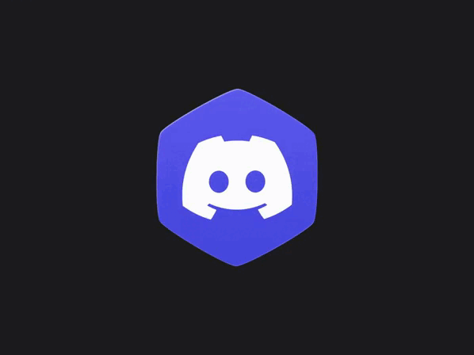
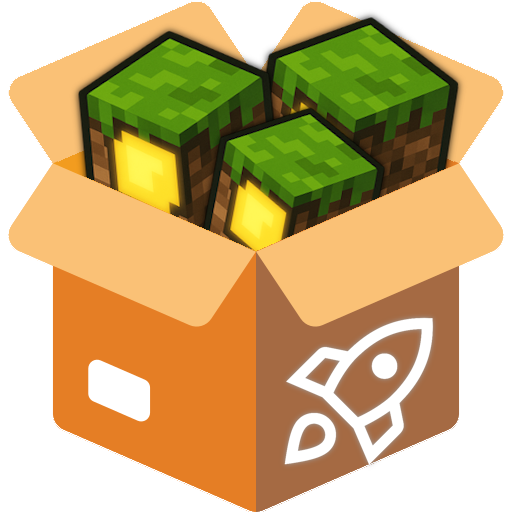
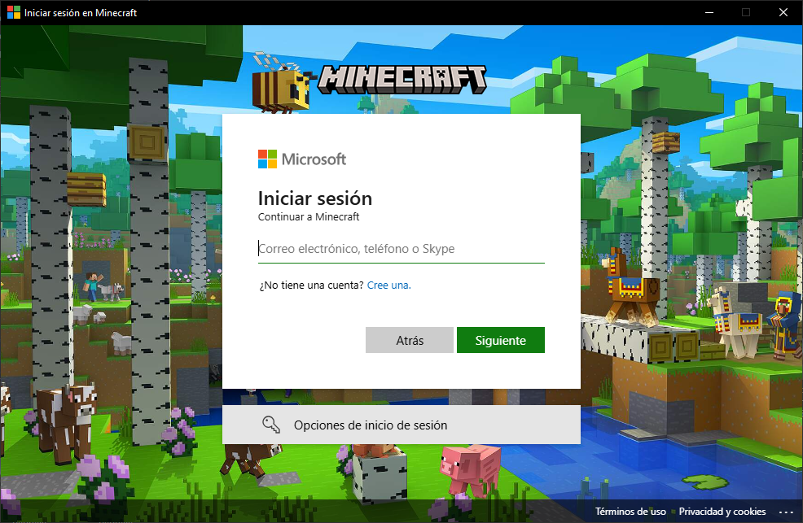

<p align="center">
  
</p>


[](https://www.npmjs.com/package/minecraft-core-master)
[](https://www.apache.org/licenses/LICENSE-2.0)

# Minecraft-Core-Master

**Minecraft-Core-Master** es una **librería modular** escrita en **TypeScript** (con soporte completo para **JavaScript**) que permite descargar Minecraft, crear instancias, gestionar loaders y ejecutar cualquier versión directamente desde los servidores oficiales de Mojang. Gracias a su arquitectura basada en **eventos**, es ideal para integrarse en **launchers personalizados** (como los desarrollados en **Electron**), ofreciendo retroalimentación en tiempo real sobre progreso, errores y estado de ejecución, para una experiencia visual y control total del flujo de instalación y ejecución.

Desarrollado por **NovaStep Studios** con un enfoque en rendimiento, control total, personalización y compatibilidad total con versiones *legacy*, *modernas* y con Loaders populares.

Este proyecto no está afiliado ni respaldado oficialmente por **Modrinth.**

[Modrinth](https://modrinth.com)

¿Tienes dudas o quieres charlar con la comunidad?  
Únete a nuestro [Discord Oficial](https://discord.gg/YAqpTWQByM) y recibe ayuda rápida, noticias y tips directamente de otros usuarios o de **``Stepnicka!``**.  

<p align="center">
  
  <p align="center">
    <a href="https://discord.gg/YAqpTWQByM" target="_blank">
      
    </a>
  </p>
</p>

---

<!-- Documentacion / Docs : [Minecraft-Core-Master-Docs](https://minecraft-core-master.web.app/) -->
### **Apoyar**
Mercado Pago :
 - CVU : 0000003100051190149138
 - Alias : stepnickasantiago


## **Instalacion**

**``npm i minecraft-core-master``**

**``yarn add minecraft-core-master``**

**``pnpm add minecraft-core-master``**

Dependencias que utiliza : **prompt, uuid, adm-zip, node-fetch, adm-zip**

Compatible con : **Module**, **CommonJS**

## **Componentes principales**

<p align="center">
  
</p>

Clase que descarga todos los recursos necesarios para ejecutar Minecraft:

* ► Java Runtime (JVM) oficial o personalizado.
* ► Librerías del juego.
* ► Assets/Resources (texturas, sonidos, fuentes, etc.).
* ► Cliente ( `client.jar` ).
* ► Archivos nativos específicos para tu sistema operativo.
* ► Creacion de carpetas

#### 🧪 Uso básico

```js
const { MinecraftDownloader } = require("../dist/index");

async function main() {
  const downloader = new MinecraftDownloader();

  // Escuchar progreso global
  downloader.on("progress", ({ current, stepPercent, totalPercent }) => {
    console.log(`[PROGRESO] ${current} | Progreso: ${stepPercent}% | Total: ${totalPercent}%`);
    });

  // Escuchar cuando un paso termina
  downloader.on("step-done", (name) => {
    console.log(`[COMPLETADO] ${name}`);
  });

  // Advertencias
  downloader.on("warn", (msg) => {
    console.warn(`[ADVERTENCIA] ${msg}`);
  });

  // Errores
  downloader.on("error", (err) => {
    console.error(`[ERROR] ${err.message}`);
  });

  // Información general
  downloader.on("info", (msg) => {
    console.log(`[INFO] ${msg}`);
  });

  // Cuando todo el proceso finalice
  downloader.on("done", () => {
    console.log(`✅ Descarga completa de todos los componentes de Minecraft!`);
  });

  // Iniciar descarga
  await downloader.start({
    root:".minecraft",
    version:"1.12.2",
    concurrency:false, // False = Descargar 1 x 1 | Number "Ej. 2" Descargara de 2 en 2 ( 2 x 1 )
    installJava: false, /** Descarga de Java Ej. "22", "17", "etc" */ // https://launchermeta.mojang.com/v1/products/java-runtime/2ec0cc96c44e5a76b9c8b7c39df7210883d12871/all.json
    variantJava: "release", // Snapshot | Alpha | Legacy | Beta
    bundle: true
  });
}

main().catch(console.error);
```

<p align="center">
  
  <h1 align="center">createInstancie</h1>
</p>

### ¿Como crear una instancia?

```js
const { MinecraftDownloader, Mojang } = require('minecraft-core-master');

(async () => {
  const CreateInstancie = new MinecraftDownloader();

  // Escuchar eventos
  CreateInstancie.on("progress", ({ current, stepPercent, totalPercent }) => {
    console.log(`[PROGRESS] ${current} - Paso: ${stepPercent}% - Total: ${totalPercent}%`);
  });

  CreateInstancie.on("info", (...args) => console.log("ℹ️ [INFO]", ...args));
  CreateInstancie.on("warn", (...args) => console.warn("⚠️ [WARN]", ...args));
  CreateInstancie.on("error", (...args) => console.error("❌ [ERROR]", ...args));
  CreateInstancie.on("step-done", (step) => console.log(`✅ Paso completado: ${step}`));
  CreateInstancie.on("done", () => console.log("🎉 Descarga completada!"));

  const user = await Mojang.login("Stepnicka012");

  const Opts = {
    root: "./.minecraft",
    version: "1.12.2",
    installJava: false,
    variantJava: "release",
    concurrency: false,

    manifest: {
      name: "Mi Instancia", // Nombre de la instancia [ Obligatorio ]
      description: ["", ""], // Descripcion de la instancia [ Opcional ]
      icon: "" // Icono de la instancia [ Opcional ]
    },

    userConfig: {
      authenticator: user // Datos del Usuario [ Opcional ]
    },

    gameConfig: {
      resolution: { width: "1280", height: "720", fullscreen: false },
      memory: { min: "512M", max: "4G" },
      javaArgs: [],
      gameArgs: []
    } // Configuracion de la instancia para iniciar [ Obligatorio ]
  };

  await CreateInstancie.createInstancie(Opts);

  console.log("🎉 Instancia lista para usar!");
})();
```
### Archivo Manifest.json [ Instancia ] ( Instancie Config Manifest )
```json
{
  "id": "mi-instancia",
  "manifest": {
    "name": "Mi Instancia",
    "description": [
      "",
      ""
    ],
    "icon": "",
    "created": "2025-08-31T01:54:28.564Z"
  },
  "userConfig": {
    "authenticator": {
      "access_token": "1d089d62dc16cc10a60040443443db4a",
      "client_token": "1d089d62dc16cc10a60040443443db4a",
      "uuid": "1d089d62dc16cc10a60040443443db4a",
      "name": "Stepnicka012",
      "user_properties": "{}",
      "meta": {
        "online": false,
        "type": "Mojang"
      }
    }
  },
  "gameConfig": {
    "resolution": {
      "width": "1280",
      "height": "720",
      "fullscreen": false
    },
    "memory": {
      "min": "512M",
      "max": "4G"
    },
    "javaArgs": [],
    "gameArgs": []
  }
}
```

---
### Parametros
| Parámetro     | Tipo                | Descripción                                                                                           | Ejemplo                                |
|---------------|---------------------|-------------------------------------------------------------------------------------------------------|----------------------------------------|
| `root`        | `string`            | Carpeta raíz donde se almacenarán todos los datos de Minecraft.                                       | `"./.minecraft"`                        |
| `version`     | `string`            | Versión de Minecraft a descargar e instalar.                                                          | `"1.12.2"`, `"1.20.1"`                  |
| `concurrency` | `boolean \| number` | Controla el modo de descarga: `false` = archivos 1x1, `number` = cantidad de descargas en paralelo.   | `false`, `2`, `5`                       |
| `installJava` | `boolean \| string` | Si es `false`, no descarga Java. Si es un número o string, descarga esa versión específica de Java. Si agregas `auto`, se instalara automaticamente la version de java que necesita `x` version del juego   | `false`,`"auto" Default`, `"17"`, `"22"`                 |
| `variantJava` | `string`            | Variante de Java a instalar.                                                                          | `"release"`, `"snapshot"`, `"beta"`     |
| `bundle`      | `boolean`           | Si es `true`, descarga e instala todo en un solo paquete (optimizado).                               | `true`, `false`                         |

---

### 📡 Eventos disponibles

| Evento        | Datos recibidos                         | Descripción                                                                 |
|---------------|------------------------------------------|-----------------------------------------------------------------------------|
| `progress`    | `{ current, stepPercent, totalPercent }` | Progreso en tiempo real de cada paso y total de la descarga.                |
| `step-done`   | `string`                                 | Nombre del paso completado (ej: `"assets"`, `"libraries"`, `"client"`).     |
| `warn`        | `string`                                 | Mensaje de advertencia durante la instalación.                              |
| `error`       | `Error`                                  | Error crítico que detiene la descarga.                                      |
| `info`        | `string`                                 | Información adicional útil para debug o seguimiento.                        |
| `done`        | `void`                                   | Evento emitido cuando **todo** el proceso finaliza correctamente.           |

---
<!-- 
### **`MinecraftLoaders`**

Instala modloaders como **Forge**, **OptiFine**, **NeoForge**, **Quilt**, **Fabric**, sobre una instalación existente de Minecraft.

#### 📦 Ejemplo de uso

```js
const {MinecraftLoaders} = require('minecraft-core-master');

const installer = new MinecraftLoaders().neoforge({
  root: '.minecraft',        // Ruta a la carpeta raíz
  version: '21.4.0-beta'     // Versión de NeoForge
});

installer.on('data', (msg) => {
  console.log(`[NeoForge] ${msg}`);
});

installer.on('done', () => {
  console.log("✅ NeoForge instalado correctamente.");
});

installer.on('error', (err) => {
  console.error("❌ Error durante la instalación:", err);
});
```

```js
const {MinecraftLoaders} = require('minecraft-core-master');

new MinecraftLoaders().forge({
  root: './.minecraft',
  version: '1.16.5-36.2.20',
})
  .on('data', (msg) => {
    console.log(`[Forge] Progreso: ${msg.progress}/${msg.total}`);
  })
  .on('done', () => {
    console.log('[Forge] Instalación completada');
  })
  .on('error', console.error);
```
### ¿Como Obtener versiones?
```js
const { MinecraftLoaders } = require('minecraft-core-master');

const Loader = new MinecraftLoaders().getVersions({
  type:'forge' // Fabric, LegacyFabric, Quilt, Forge, NeoForge
  }).on('data',(msg) =>{
    console.log(msg);
});
```
Otros modloaders: Fabric, LegacyFabric, Quilt, Neoforge.

Puedes ver ejemplos en la carpeta de pruebas:
[TestLoaders](https://GitLab.com/NovaStepStudios/Minecraft-Core-Master/tree/main/test/Loaders)

#### ℹ️ Notas

* La carpeta `root` debe contener una instalación válida de Minecraft.
* Requiere **Java en PATH** para instalar Forge.
* No descarga Minecraft base, solo inyecta el modloader deseado. -->

---
<p align="center">
  
</p>

Clase que permite **lanzar Minecraft** con control total: configuración de memoria, ruta Java, ventana, argumentos, y sistema de logs y errores con persistencia.

```js
const { MinecraftLauncher, Mojang } = require('minecraft-core-master');

(async () => {
  // Autenticación (offline en este ejemplo)
  const user = await Mojang.login("Stepnicka012");
  console.log(user); // Debug de usuario

  const launcherOptions = {
    version: '1.21.5',                // Versión de Minecraft [ Selecciona automaticamente el tipo de version ]
    root: './.minecraft',             // Carpeta raíz
    javaPath: 'C:/Program Files/Java/jdk-21/bin/javaw.exe', // Opcional [ Resuelve ruta por si solo si no encuentra Java pedira al usuario que inserte un path ]
    
    jvmArgs: [],   // Argumentos JVM opcionales
    mcArgs: [],    // Argumentos del cliente opcionales
    debug: false,  // Activar logs de depuración

    memory: {      // Configuración de RAM
      min: "512M",
      max: "2G"
    },

    authenticator: user,  // Objeto devuelto por Mojang/Microsoft/etc.

    window: {      // Opciones de ventana
      width: "854", // Number
      height: "480", // Number
      fullscreen: false // True
    }
  };

  const launcher = new MinecraftLauncher(launcherOptions);

  // Escuchar eventos
  launcher.on('debug', (msg) => console.log('[DEBUG]', msg));
  launcher.on('warn', (msg) => console.warn('[WARN]', msg));
  launcher.on('error', (err) => console.error('[ERROR]', err));
  launcher.on('data', (msg) => console.log('[DATA]', msg));

  try {
    await launcher.launch();
    console.log("✅ Minecraft lanzado correctamente!");
  } catch (err) {
    console.error("❌ Falló el lanzamiento:", err);
  }
})();
```
---

### **`launchInstancie`**

<p align="center">
  
  <h1 align="center">launchInstancie</h1>
</p>

Permite **lanzar instancias preconfiguradas**, donde cada carpeta de instancia contiene su propio `Manifest-Instancie.json` junto con los archivos de Minecraft.
Esto hace que el launcher pueda leer automáticamente la configuración sin necesidad de pasar todos los parámetros manualmente.

📂 **Estructura esperada:**

```
rootBase/
 └── instancies/
     └── mi-instancia/
         ├── Manifest-Instancie.json
         ├── versions/
         ├── libraries/
         └── assets/
         └── ...
```

📜 **Ejemplo de uso:**

```js
const { MinecraftLauncher } = require('minecraft-core-master');
const path = require('path');

(async () => {
  // Inicializar el launcher (mínimo requiere Java)
  const launcher = new MinecraftLauncher({
    javaPath: 'C:/Program Files/Java/jre1.8.0_461/bin/javaw.exe'
  });

  // Eventos
  launcher.on('debug', (msg) => console.log('[DEBUG]', msg));
  launcher.on('warn', (msg) => console.warn('[WARN]', msg));
  launcher.on('error', (err) => console.error('[ERROR]', err));
  launcher.on('data', (msg) => console.log('[DATA]', msg));

  try {
    await launcher.launchInstancie(
      path.resolve("./.minecraft"), // Ruta base
      "mi-instancia"                // Nombre de la instancia
    );
    console.log("✅ Minecraft lanzado correctamente desde la instancia!");
  } catch (err) {
    console.error("❌ Falló el lanzamiento:", err);
  }
})();
```

---

| Parámetro           | Tipo              | Descripción                                                                                | Ejemplo                                        |
| ------------------- | ----------------- | ------------------------------------------------------------------------------------------ | ---------------------------------------------- |
| `version`           | `string`          | Versión de Minecraft a ejecutar.                                                           | `"1.21.5"`, `"1.20.1"`                         |
| `loader`            | `string`          | Loader a ejecutar (Forge, Fabric, NeoForge, etc.).                                         | `"1.21.5-forge-55.0.24"`                       |
| `root`              | `string`          | Carpeta raíz de `.minecraft`.                                                              | `"./.minecraft"`                               |
| `javaPath`          | `string`          | Ruta al ejecutable de Java (`javaw.exe` o `java`).                                         | `"C:/Program Files/Java/jdk-21/bin/javaw.exe"` |
| `jvmArgs`           | `string[]`        | Argumentos adicionales para la JVM (rendimiento, debug, compatibilidad).                   | `["-XX:+UseG1GC"]`                             |
| `mcArgs`            | `string[]`        | Argumentos adicionales para Minecraft.                                                     | `["--fullscreen"]`                             |
| `debug`             | `boolean`         | Activa logs de depuración detallados.                                                      | `true`                                         |
| `memory.min`        | `string`          | Memoria mínima asignada a la JVM.                                                          | `"512M"`, `"1G"`                               |
| `memory.max`        | `string`          | Memoria máxima asignada a la JVM.                                                          | `"2G"`, `"8G"`                                 |
| `authenticator`     | `object`          | Objeto devuelto por autenticadores (`Mojang`, `Microsoft`, `NovaAZauth`, etc.).                | `{ access_token, uuid, name, ... }`            |
| `window.width`      | `number`  | Ancho de ventana.                                | `854`                                         |
| `window.height`     | `number`  | Alto de ventana.                                                                           | `480`                                          |
| `window.fullscreen` | `boolean \| null` | Define si se inicia en pantalla completa. `null` = configuración por defecto de Minecraft. | `true`                                         |

---

### Login Con Mojang


```js
const { Mojang } = require('minecraft-core-master');

async function MojangLogin() {
  try {
    // Login con nombre de usuario Mojang
    const user = await Mojang.login("Stepnicka012");
    console.log(user);

    /**
     * Ejemplo de objeto devuelto:
     * {
     *   access_token: '3cb84f07461800a947dffb283de26ac7',
     *   client_token: '3cb84f07461800a947dffb283de26ac7',
     *   uuid: '3cb84f07461800a947dffb283de26ac7',
     *   name: 'Stepnicka012',
     *   user_properties: '{}',
     *   meta: { online: false, type: 'Mojang' }
     * }
     */
  } catch (err) {
    console.error("❌ Error al hacer login con Mojang:", err);
  }
}

MojangLogin();
```
| Campo             | Tipo     | Descripción                                                  |
| ----------------- | -------- | ------------------------------------------------------------ |
| `access_token`    | `string` | Token de acceso para iniciar sesión y ejecutar Minecraft.    |
| `client_token`    | `string` | Token de cliente generado durante la autenticación.          |
| `uuid`            | `string` | UUID único del usuario.                                      |
| `name`            | `string` | Nombre de usuario autenticado.                               |
| `user_properties` | `string` | JSON con propiedades adicionales del usuario.                |
| `meta`            | `object` | Información adicional: `{ online: boolean, type: 'Mojang' }` |

---

### Login Con Microsoft
```js
const { Microsoft, MinecraftLauncher } = require('minecraft-core-master');

(async () => {
  try {
    // 1️⃣ Instancia de Microsoft
    const ms = new Microsoft(''); // Client ID opcional

    // 2️⃣ Login interactivo (terminal/electron)
    const auth = await ms.getAuth('terminal');
    if (!auth || auth.error) {
      console.error('❌ Login falló:', auth?.error ?? 'cancelado');
      return;
    }
    console.log('✅ Login exitoso:', auth.name);

    // 3️⃣ Obtener perfil de Minecraft
    const profile = await ms.getProfile({ access_token: auth.access_token });
    if ('error' in profile) {
      console.error('❌ Error obteniendo perfil:', profile.error);
      return;
    }

    console.log('Perfil Minecraft:', profile.name);
    console.log('Skins disponibles:', profile.skins.length);
    console.log('Capes disponibles:', profile.capes.length);

    // 4️⃣ Preparar autenticador para MinecraftLauncher
    const userData = {
      access_token: auth.access_token,
      client_token: auth.client_token ?? auth.uuid,
      uuid: profile.id,
      name: profile.name,
      user_properties: '{}',
      meta: { online: true, type: 'msa' },
    };

    // 5️⃣ Lanzar Minecraft (ejemplo 1.20.1)
    const launcher = new MinecraftLauncher({
      version: '1.20.1',
      root: './.minecraft',
      javaPath: 'java',
      authenticator: userData,
      memory: { min: '2G', max: '4G' },
      window: { width: 1280, height: 720, fullscreen: false },
    });

    launcher.on('progress', console.log);
    launcher.on('info', console.log);
    launcher.on('warn', console.warn);
    launcher.on('error', console.error);
    launcher.on('data', (child) => {
      child.on('close', code => console.log('Minecraft cerrado con código:', code));
    });

    await launcher.launch();
  } catch (err) {
    console.error('❌ Error fatal:', err);
  }
})();
```

### Obtener datos de Usuario ( Microsoft )
```js
const { Microsoft } = require("minecraft-core-master");

async function main() {
  const ms = new Microsoft();

  console.log("Iniciando login con Microsoft...");

  // Intentamos login (terminal, electron o nwts según tu entorno)
  const auth = await ms.getAuth("electron");

  if (!auth || "error" in auth) {
    console.error("❌ Error al autenticar:", auth);
    return;
  }

  console.log("✅ Login correcto!");
  console.log("Access Token:", auth.access_token.substring(0, 20) + "...");
  console.log("Gamertag:", auth.xboxAccount.gamertag);
  console.log("UUID:", auth.uuid);
  console.log("Nombre:", auth.name);

  console.log("\nPerfil de Minecraft:");
  console.log("ID:", auth.profile.id);
  console.log("Nombre:", auth.profile.name);

  if (auth.profile.skins.length > 0) {
    console.log("Skins:", auth.profile.skins.map(s => s.url));
  } else {
    console.log("Sin skins 😢");
  }

  if (auth.profile.capes.length > 0) {
    console.log("Capes:", auth.profile.capes.map(c => c.url));
  } else {
    console.log("Sin capas 🦸");
  }
}

main().catch(err => console.error("💥 Error fatal:", err));
```
<p align="center">
  
</p>

| Campo             | Tipo   | Descripción                            |
| ----------------- | ------ | -------------------------------------- |
| `access_token`    | string | Token de sesión devuelto por Microsoft |
| `client_token`    | string | Token de cliente (fallback UUID)       |
| `uuid`            | string | UUID real de la cuenta                 |
| `name`            | string | Nombre del jugador                     |
| `user_properties` | string | JSON adicional para el juego           |
| `meta`            | object | `{ online: boolean, type: 'msa' }`     |

---

<p align="center">
  <h1 align="center">NovaAZauth</h1>
</p>

**NovaAZauth** es un **autenticador personalizado de Minecraft** que permite iniciar sesión contra un **servidor propio** (en este caso `https://nincraft.fr`) en lugar de los servidores oficiales de Mojang o Microsoft. Está diseñado para integrarse de forma directa con **MinecraftLauncher** de tu proyecto, generando un objeto `authenticator` completamente compatible para ejecutar Minecraft con credenciales gestionadas por tu propio backend.

#### Características principales:

* Soporta **login estándar** con email/usuario y contraseña.
* Gestiona **2FA (doble factor de autenticación)** de manera interactiva si está habilitado.
* Genera un objeto `authenticator` con todos los datos necesarios (`access_token`, `client_token`, `uuid`, `name`, `user_properties`, etc.).
* Permite **verificar y refrescar sesiones** sin necesidad de reingresar credenciales.
* Compatible con cualquier versión de Minecraft y launchers basados en tu `MinecraftLauncher`.

```js
const prompt = require('prompt')
const { NovaAZauth, MinecraftLauncher } = require('minecraft-core-master');
const auth = new NovaAZauth('https://nincraft.fr');
const fs = require('fs');

let mc
async function login() {
    console.log('Inserte tu Email');
    prompt.start();
    let { email } = await prompt.get(['email']);
    console.log('Inserta tu Contrseña');
    let { password } = await prompt.get(['password']);
    let azauth = await auth.login(email, password);

    if (azauth.A2F) {
        console.log('Esperando codigo...');
        let { code } = await prompt.get(['code']);
        azauth = await auth.login(email, password, code);
    }

    if (azauth.error) {
        console.log(azauth);
        process.exit(1);
    }
    return azauth;
}

async function main() {
    if (!fs.existsSync('./NovaAZauth.json')) {
        mc = await login();
        fs.writeFileSync('./NovaAZauth.json', JSON.stringify(mc, null, 4));
    } else {
        mc = JSON.parse(fs.readFileSync('./NovaAZauth.json'));

        if (!mc.access_token) {
            mc = await login();
            fs.writeFileSync('./NovaAZauth.json', JSON.stringify(mc, null, 4));
        } else {
            mc = await auth.verify(mc);
            if (mc.error) mc = await login();
            fs.writeFileSync('./NovaAZauth.json', JSON.stringify(mc, null, 4));
        }
    }

    let opt = {
        version: '1.21.8-OptiFine_HD_U_J6_pre16',
        root: './.minecraft',
        javaPath: "C:/Program Files/Java/jdk-24/bin/javaw.exe",
        jvmArgs: [], // Argumentos de JVM *Java* [ Opcional ]
        mcArgs:[], // Argumentos de Minecraft [ Opcional ]
        debug: true, // Modo Deubg [ Opcional ]
        memory:{
            min: "512M",
            max: "4G"
        },
        authenticator: {
            ...mc,
            name: mc.name.slice(0,16) // Limitar Nombre a 16 Caracteres
        },
        window: {
            width: null,
            height: null,
            fullscreen: false
        }
    }

    const launcher = new MinecraftLauncher(opt);
    try{
        await launcher.launch();
    } catch (err){
        console.log("Fallo el lanzamiento de Minecraft :",err)
    }

    launcher.on('debug', (msg) => console.log('[DEBUG]', msg));
    launcher.on('warn', (msg) => console.warn('[WARN]', msg));
    launcher.on('error', (err) => console.error('[ERROR]', err));
    launcher.on('data', (msg) => console.log(msg));
}
main()
```

| Campo / Objeto                  | Tipo              | Descripción                                                                                    |
| ------------------------------- | ----------------- | ---------------------------------------------------------------------------------------------- |
| `NovaAZauth.login(username, password)` | `Promise<object>` | Autenticación contra tu servidor NovaAZauth. Devuelve un objeto compatible con `authenticator`.    |
| `authenticator`                 | object            | Objeto devuelto por NovaAZauth que se pasa directamente a `MinecraftLauncher` para iniciar sesión. |


#### Objeto devuelto (`authenticator`):

| Campo             | Tipo   | Descripción                                                                                                                                                          |
| ----------------- | ------ | -------------------------------------------------------------------------------------------------------------------------------------------------------------------- |
| `access_token`    | string | Token de acceso válido para iniciar sesión.                                                                                                                          |
| `client_token`    | string | Token único del cliente.                                                                                                                                             |
| `uuid`            | string | Identificador único del usuario.                                                                                                                                     |
| `name`            | string | Nombre del jugador. **Debe tener un máximo de 16 caracteres**, ya que Minecraft no permite enviar nombres más largos al servidor y causará un error de codificación. |
| `user_properties` | string | JSON con propiedades del usuario.                                                                                                                                    |
| `meta`            | object | Información extra, como tipo de autenticador y si está online.                                                                                                       |
| `profile.skins`   | array  | Lista de skins asociadas al usuario (URL/base64).                                                                                                                    |

<p align="center">
  
  <h1 align="center">MrpackExtractor</h1>
  <p align="center">Este proyecto no está afiliado ni respaldado oficialmente por <strong>Modrinth.</strong> El logo de <strong>Modrinth se utiliza únicamente con fines identificativos y de referencia</strong><p>
</p>

**MrpackExtractor** Sirve para extraer los archivos con formato ``.mrpack`` de Modrinth, esto sirve para tus launcher de Mods!
Permite Extraer el ``.mrpack`` Y descargar los Mods/Jar que ayan en el ModPack, hace verificacion para evitar Reescribir archivos, Verifica SHA

### Ejemplo de Uso :
```js
const path = require('path');
const { MrpackExtractor } = require('minecraft-core-master');

async function main() {
  const extractor = new MrpackExtractor();

  // Escuchamo el Progreso del archivo a Descargar
  extractor.on('progress', (progress) => {
    console.log(`Progreso: ${progress}`);
  });
  // Devuelve el nombre del archivo que se a descargado
  extractor.on('fileName', (msg) => {
    console.log('Archivo :',msg);
  });
  // Escuchamos el evento al terminar Descargar
  extractor.on('done', () => {
    console.log('Modpack instalado correctamente.');
  });
  // Errores Durante la descarga
  extractor.on('error', (err) => {
    console.error('Error detectado:', err.message, context);
  });
  // Evento para poder escuchar si ay un archivo que ay que volver a descargar por mala conexion
  extractor.on('retry', (file) => {
    console.log(`Reintentando descarga: ${file}`);
  });

  try {
    await extractor.extract({
      root: '.minecraft', // Ruta de carpeta de Minecraft para extraer archivos ( Mods, Config, Etc... )
      filePath: path.join(__dirname, 'FileTest/Reimagined Intro 1.21.4.mrpack'), // Archivo .mrPack
      keepMrpack: true,  // opcional [ Mantener el .mrpack intacto ]
      concurry: 5,       // descargas paralelas 
      recursive: true,   // sobrescribir archivos si existen
      verify: true       // verificar SHA
    });
  } catch (err) {
    console.error('Fallo grave durante la instalación del modpack:', err);
  }
}
main();
```

---
<p align="center">
  
  <h1 align="center">CFModpackExtractor</h1>
</p>

`CFModpackExtractor` es una herramienta en Node.js para **descargar e instalar modpacks de CurseForge** automáticamente desde un archivo `manifest.json`. Permite descargas paralelas, manejo de errores, progreso en tiempo real y copiado de overrides.

## 🔹 Uso Básico

```ts
import path from 'path';
import { CFModpackExtractor } from './CFModpackExtractor';

async function main() {
  const extractor = new CFModpackExtractor();

  // Eventos
  extractor.on('progress', (file, percent) => console.log(`[PROGRESS] ${file} | ${percent}`));
  extractor.on('fileName', (name) => console.log(`[FILE] ${name} descargado.`));
  extractor.on('retry', (file, attempt, msg) => console.log(`[RETRY] ${file} intento ${attempt}: ${msg}`));
  extractor.on('errors', (err) => console.error(`[ERROR]`, err.message));
  extractor.on('done', () => console.log('[DONE] Modpack instalado correctamente.'));

  // Extraer modpack
  try {
    await extractor.extract({
      root: path.join(__dirname, '.minecrafttest'), // Carpeta donde se instalarán los mods
      filePath: path.join(__dirname, 'Builders Paradise-1.1.4/manifest.json'), // Archivo JSON del modpack
      apiKey: 'TU_API_KEY_DE_CURSEFORGE', // Opcional | Ya trae uno por defecto proporcionado por Curseforge Studios
      concurrency: 5,   // Descargas paralelas
      recursive: true,  // Sobrescribir mods existentes
      keepJson: true,   // Mantener JSON original
      maxRetries: 3,    // Reintentos por archivo
    });
  } catch (err) {
    console.error('Fallo grave durante la instalación del modpack:', err);
  }
}

main();
```

---

## 🔹 Opciones de `extract`

| Opción        | Tipo    | Descripción                                                                  |
| ------------- | ------- | ---------------------------------------------------------------------------- |
| `root`        | string  | Carpeta donde se instalarán los mods.                                        |
| `filePath`    | string  | Ruta al archivo `manifest.json` del modpack.                                 |
| `apiKey`      | string  | API Key de CurseForge. Necesario para descargas privadas o muchas descargas. |
| `concurrency` | number  | Número de descargas simultáneas (por defecto: false = secuencial).           |
| `recursive`   | boolean | Sobrescribir mods existentes (por defecto: false).                           |
| `keepJson`    | boolean | Mantener el JSON original en la carpeta cache (por defecto: true).           |
| `maxRetries`  | number  | Cantidad máxima de reintentos por archivo (por defecto: 3).                  |

---

## 🔹 Eventos

* `progress(file, percent)` → Avance de descarga de cada archivo.
* `fileName(name)` → Archivo descargado correctamente.
* `retry(file, attempt, msg)` → Reintento de descarga por error.
* `errors(err)` → Error crítico durante la instalación.
* `done()` → Modpack instalado exitosamente.
* `fileInfo({ fileName, required })` → Información de cada mod descargado.


# Status

Un módulo para obtener el estado de un servidor Minecraft (versión Java) usando Node.js, con soporte de lectura de paquetes y buffers personalizados.
## Uso

```js
const { Status } = require('Minecraft-Core-Master');

async function main() {
    // Crear una instancia de Status
    const server = new Status("play.example.com", 25565);

    try {
        // Obtener el estado del servidor
        const status = await server.getStatus();

        console.log("Estado del servidor:");
        console.log(`- Latencia: ${status.ms} ms`);
        console.log(`- Versión: ${status.version}`);
        console.log(`- Jugadores conectados: ${status.playersConnect}/${status.playersMax}`);
    } catch (err) {
        console.error("Error al obtener el estado del servidor:", err);
    }
}

main();
```

### Salida esperada

```
Estado del servidor:
- Latencia: 120 ms
- Versión: 1.20.1
- Jugadores conectados: 12/100
```

---

### Características

* Soporte completo de buffers para lectura y escritura de datos de Minecraft.
* Ping a servidores Java Edition de Minecraft.
* Funciona con Node.js v16+.

<p align="center">
  
</p>

MC-CORE es un CLI para descargar y lanzar Minecraft usando los módulos `MinecraftDownloader` y `MinecraftLauncher`.

## Comandos disponibles:

---

### 1. **download**

Sintaxis:

```bash
mc-core download <version> <dir> [concurrency] [installJava]
```

* **version**: Versión de Minecraft a descargar (ej: 1.12.2)
* **dir**: Directorio donde se instalará Minecraft (ej: `.minecraft`)
* **concurrency** (opcional): Número de descargas simultáneas (por defecto: 1)
* **installJava** (opcional): true/false para instalar Java automáticamente si no está presente (por defecto: false)

Ejemplo:

```bash
mc-core download 1.19.2 ./minecraft 5 true
```

Salida esperada:

```text
[ PROGRESS ] { current: 'Assets | 1305/1305', stepPercent: 100, totalPercent: 80 }
[ DEBUG ] Assets
[ PROGRESS ] { current: 'Cliente | 3/3', stepPercent: 100, totalPercent: 100 }
[ DONE ] Descarga completada
Minecraft se ha descargado exitosamente: Dir. ./minecraft, Vers. 1.19.2, InstallJava: true
```

---

### 2. **launch**

Sintaxis:

```bash
mc-core launch <version> <dir> <username> [debug] [memoryMax] [memoryMin]
```

* **version**: Versión de Minecraft a lanzar (ej: 1.12.2)
* **dir**: Directorio de instalación de Minecraft (ej: `.minecraft`)
* **username**: Nombre del jugador que aparecerá en el launcher (ej: `Player`)
* **debug** (opcional): true para activar logs detallados (por defecto: false)
* **memoryMax** (opcional): Memoria máxima para Java (por defecto: 2G)
* **memoryMin** (opcional): Memoria mínima para Java (por defecto: 512M)

Ejemplo:

```bash
mc-core launch 1.19.2 ./minecraft StepNicka true 4G 1G
```

Salida esperada:

```text
[DEBUG] Iniciando Minecraft 1.19.2
[DEBUG] Usuario: StepNicka
[DEBUG] Memoria asignada: 1G - 4G
[DEBUG] Lanzador iniciado correctamente
```

---

### 3. **version**

Sintaxis:

```bash
mc-core -v
mc-core --version
```

Muestra la versión actual del paquete MC-CORE:

```text
Minecraft-Core-Master version: 7.5.5
```

---

> **Nota:** Este proyecto soporta el lanzamiento y gestión de **todas las versiones oficiales de Minecraft**, desde las más recientes hasta las más antiguas, incluyendo snapshots, betas, alphas y versiones históricas como la legendaria **rd-132211**. No importa qué tan vintage o moderna sea la versión, Minecraft-Core-Master la ejecutará con total estabilidad y rendimiento.


### 📁 Gestión avanzada de logs y errores

* Los logs críticos y reportes de fallos se almacenan automáticamente en la carpeta `root/logs` bajo archivos con prefijo `minecraft-core-master*.log`, permitiendo una inspección detallada para diagnósticos rápidos y precisos.
* Toda la salida estándar (`stdout`) y salida de error (`stderr`) del proceso Minecraft se expone en tiempo real a través de eventos, lo que facilita la integración con GUIs personalizadas, consolas o herramientas de monitoreo remoto.
* La arquitectura basada en eventos permite capturar errores de manera proactiva y reaccionar ante ellos sin bloquear el flujo del programa, garantizando una experiencia estable para el usuario final.

---

## 📜 Scripts de prueba y demostración ( GitLab )

Incluimos ejemplos robustos en la carpeta `test/` para que puedas probar cada componente de forma independiente o integrada. Estos scripts incluyen manejo de eventos detallado, seguimiento de progreso y captura de errores:

```bash
node test/Instancie/StartInstancie.js       # Ejecuta Minecraft En una Instancia con Config y usuario Propio.
node test/Instancie/CreateInstancie.js      # Crea Tu Instancia de Minecraft!

node test/Login/NovaAZauth.js               # Ejecuta Minecraft Con Tu Propio Servidor de Authenticacion.
node test/Login/Mojang.js                   # Ejecuta Minecraft Con Mojang.
node test/Login/Microsoft.js                # Ejecuta Minecraft Con Microsoft.

node test/Modpacks/CFModpackExtractor.js       # Descarga y prepara Tu modpack de Curseforge.
node test/Modpacks/mrpackExtractor.js       # Descarga y prepara Tu modpack de Modrinth.

node test/Download.js                       # Descarga y prepara cualquier versión de Minecraft con validación.
node test/Start.js                          # Ejecuta Minecraft con configuración avanzada y monitoreo. En Mantenimiento
```

Estos ejemplos sirven tanto para pruebas rápidas como para entender cómo extender o integrar Minecraft-Core-Master en tus proyectos.

<p align="center">
  
</p>

## 🧪 Características técnicas sobresalientes

* ► **Descarga Oficial y Segura:** Todos los archivos se obtienen directamente de los servidores de Mojang, con **validación por hash**, asegurando integridad y confiabilidad absoluta.

* ► **Compatibilidad total con versiones oficiales:** Soporte completo para **todas las versiones de Minecraft**, incluyendo snapshots, betas, alphas, versiones históricas y cualquier versión custom que cumpla con el estándar oficial.

* ► **Soporte completo para modloaders y clientes custom:** Compatible con **Forge, Fabric, NeoForge, Optifine, Quilt, Battly Client y BatMod**, permitiendo ejecutar prácticamente cualquier configuración de Minecraft.

* ► **Arquitectura modular y extensible:** Componentes diseñados para ser **reutilizables y escalables**, listos para integrarse en launchers personalizados o proyectos propios, con **documentación completa y eventos claros**.

* ► **Eventos en tiempo real:** Feedback dinámico de progreso, errores, advertencias e información mediante `EventEmitter`, ideal para **interfaces gráficas, consolas o sistemas de monitoreo**.

* ► **Multiplataforma :** Comprobado en **Windows, Linux y macOS**, con **manejo automático de archivos nativos** y rutas Java, garantizando ejecución sin problemas en cualquier sistema.

* ► **Control avanzado de ejecución de Minecraft:** Configuración completa de **memoria JVM, argumentos del juego, ventana, logs y depuración**, incluyendo persistencia de errores y salida en tiempo real.

* ► **Autenticación flexible:** Compatible con **Mojang, Microsoft y NovaAZauth**, permitiendo login offline, online y servidores propios, con manejo seguro de tokens y perfiles.

* ► **Gestión de logs y errores profesional:** Registros críticos almacenados automáticamente en `root/logs`, capturando stdout/stderr en tiempo real para **diagnósticos precisos y control total del flujo del juego**.

* ► **Optimización y rendimiento:** Descargas en paralelo, instalación de Java opcional, y **bundle completo de componentes**, garantizando procesos rápidos y confiables.

* ► **Extensibilidad para desarrolladores:** Ideal para integrar en **Electron, React o cualquier launcher personalizado**, con eventos y API claros que facilitan la construcción de herramientas avanzadas para Minecraft.

* ► **Compatibilidad histórica:** Capaz de lanzar versiones legendarias y modernas, desde **rd-132211** hasta las más recientes, con estabilidad y rendimiento garantizado.

---

<p align="center">
  
</p>

Minecraft-Core-Master nació porque me encanta Minecraft y la programación. Soy **Santiago Stepnicka (Stepnicka)**, desarrollador fullstack, y mi objetivo con este proyecto es que tengas **control total, estabilidad y buen rendimiento** en el juego, sin complicarte la vida.

🚀 **Si querés llevar tu launcher al próximo nivel:**
Ya sea que quieras crear tu propio launcher, integrar cosas con **React/Electron**, agregar soporte para mods avanzados, o hacer cualquier herramienta loca, en **NovaStep Studios** te doy la base y ejemplos para que lo logres sin dramas.

<p align="center">
  
</p>

Espero que me sigan, ¡tengo como 500 versiones de MC y mil errores que tengo que liviar yo solito >:v!  
Investigo cómo funciona **X cosa mágica del juego, o funcion**, y luego me rompo la cabeza para  
meterla en el paquete sin que explote todo. :v  

Un héroe sin capa... 🦸‍♀️  

> [NovaStep Studios en GitLab](https://GitLab.com/SantiagoStepnicka2025)
> [NovaStep Studios en GitLab](https://GitLab.com/SantiagoStepnicka2025)

> [Minecraft-Core-Master en GitLab](https://GitLab.com/SantiagoStepnicka2025/Minecraft-Core-Master)
> [Minecraft-Core-Master en Github](https://GitHub.com/SantiagoStepnicka2025/Minecraft-Core-Master)